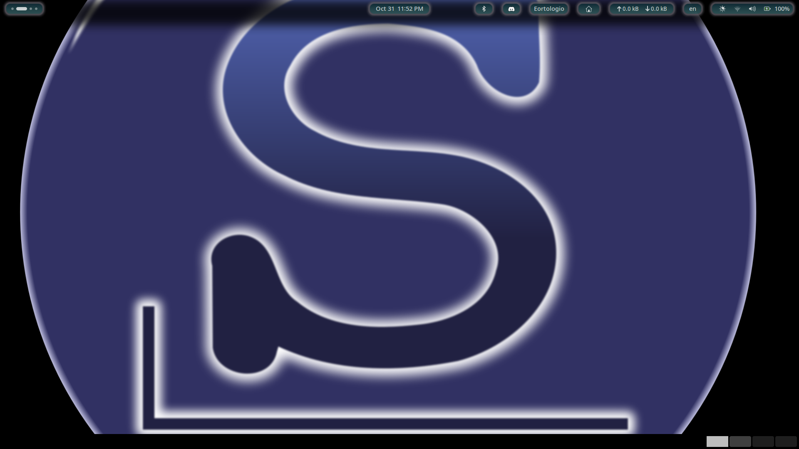
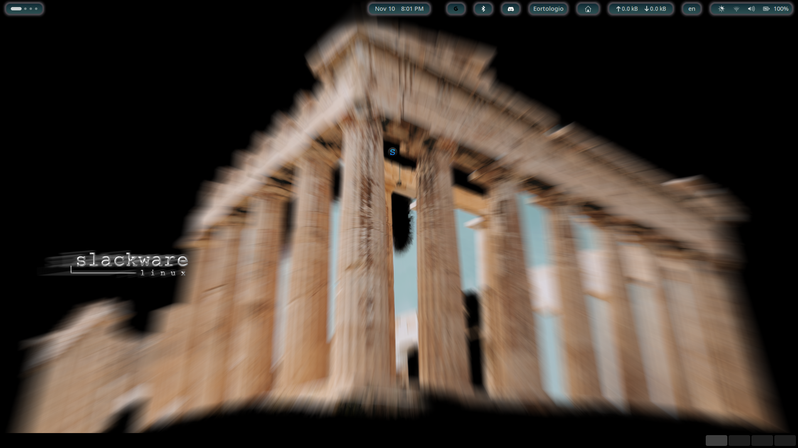

Just playing using [rembg](https://github.com/danielgatis/rembg) and Gimp in the century of AI... 
output are some Slackware wallpapers... 

---

### Update
`2024-08-12`
Added from Nassa-Callendar 2025 [modified wallpapers](./Nassa_Slackware_Wallpapers-2025)  
